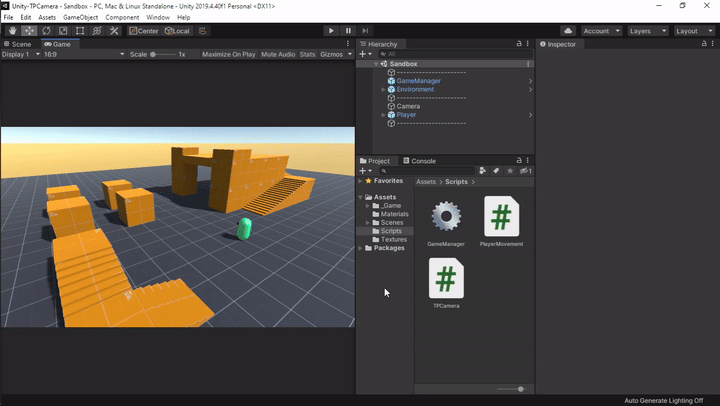

## 🎥 TPCamera
**TPCamera** is a simple third person camera system for unity project.

## 🔗 Download
download unity package: 👉 [TPCamera.unitypackage](https://github.com/vianagus/Unity-TPCamera/raw/main/_Unity%20Package/TPCamera.unitypackage) 👈

## ⚙ Installation
1. Download and import the unity package into unity project.
2. Put TPCamera.cs on **_camera object_**.
3. Assign **_object to follow_** into `Follow` attribute.
4. Assign **_object to look at_** into `Look At` attribute.

## 🧩 Attribute
Adjust the following attributes to affect the camera movement.
| Attribute                 | Type      | Description                                                   |
| ---                       | ---       | ---                                                           |
| `Follow`                  | Transform | target to follow                                              |
| `Look At`                 | Transform | target to look at                                             |
| `Max Distance`            | float     | maximum distance to target                                    |
| `Smooth Damp`             | float     | affect smooth damp speed, value = 0 will disable smooth damp  |
| `Yaw Sensitivity`         | float     | affect yaw speed                                              |
| `Pitch Sensitivity`       | float     | affect pitch speed                                            |
| `Min Pitch`               | float     | minimum pitch                                                 |
| `Max Pitch`               | float     | maximum pitch                                                 |
| `Look At Height`          | float     | `Look At`'s height offset                                     |
| `Clipping Offset`         | float     | clipping offset                                               |
| `Height Clipping Offset`  | float     | height clipping offset from ground                            |
